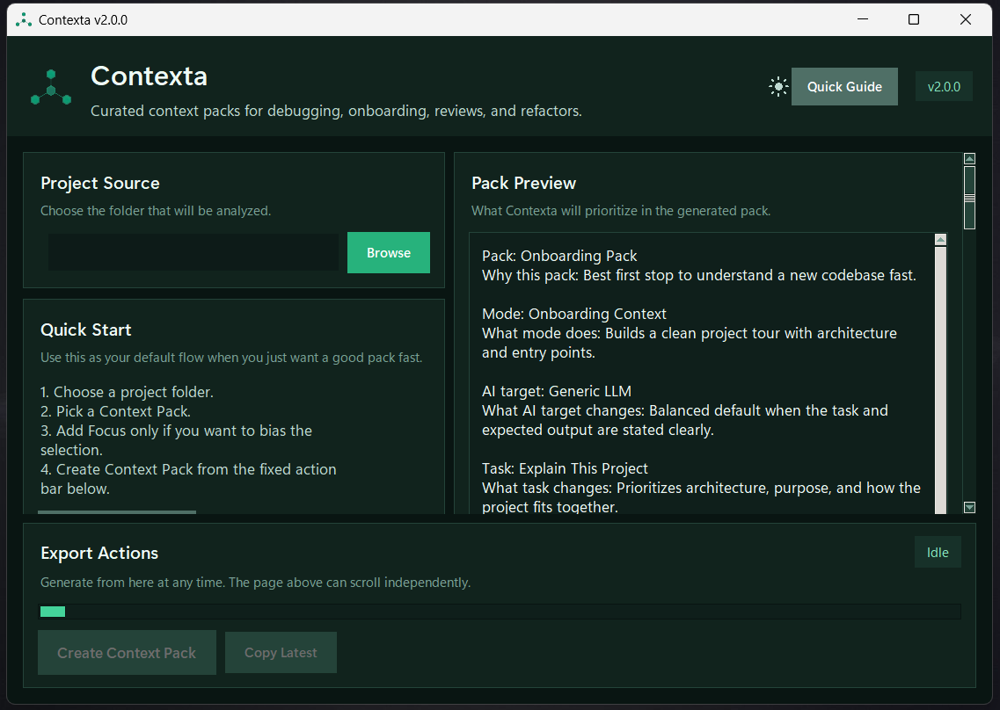

<div align="center">

# Contexta

**AI-native codebase context engine. Serves intelligent project context to Claude Code, Cursor, Windsurf, and any MCP-compatible tool — or generates curated context packs for manual use.**

[](https://python.org)
[](LICENSE)
[]()
[]()
[]()

<br>

[](https://pypi.org/project/contexta-ai/)
&nbsp;&nbsp;
[](https://github.com/pablokaua03/Contexta/releases/latest/download/contexta.exe)
&nbsp;&nbsp;
[](https://github.com/pablokaua03/Contexta/releases/latest/download/contexta-linux.tar.gz)

> Install via pip, download the portable executable, or run from source.

<br>

<picture>
  <source media="(prefers-color-scheme: dark)" srcset="assets/dark.png">
  <source media="(prefers-color-scheme: light)" srcset="assets/white.png">
  
</picture>

</div>

---

## What is Contexta

Contexta analyzes codebases and serves intelligent, curated context to AI tools. Instead of dumping files blindly, it understands project structure, detects frameworks, ranks files by importance, and delivers exactly what an AI needs.

**Three ways to use it:**

| Mode | Command | What it does |
|---|---|---|
| **MCP Server** | `contexta serve` | Runs as a tool server — Claude Code, Cursor, Windsurf call it automatically |
| **CLI** | `contexta ./project --pack onboarding` | Generates a context pack Markdown file |
| **GUI** | `contexta` | Desktop app with visual controls |

---

## MCP Server (recommended)

The MCP server is the primary way to use Contexta. AI coding assistants call it as a tool to understand your project — no copy-paste needed.

### Setup

Add to your MCP configuration (Claude Code, Cursor, Windsurf, etc.):

```json
{
  "mcpServers": {
    "contexta": {
      "command": "contexta",
      "args": ["serve"]
    }
  }
}
```

Or if running from source:

```json
{
  "mcpServers": {
    "contexta": {
      "command": "python",
      "args": ["/path/to/contexta_mcp.py"]
    }
  }
}
```

### Available tools

| Tool | What it does |
|---|---|
| `scan_project` | Quick fingerprint — type, language, frameworks, deps, entry points |
| `get_architecture` | Module relationships, folder structure, risks, key patterns |
| `generate_context` | Full AI-optimized context pack with all preset options |
| `find_files` | Search files by name, extension, or keyword |
| `read_files` | Read specific file contents |
| `list_packs` | List available pack presets |
| `cache_status` | Show cache hit/miss statistics |
| `refresh_cache` | Force-refresh cached analysis |

### Smart cache

Results are cached in memory with automatic invalidation. First call analyzes the project (~700ms), subsequent calls return in ~2ms until files change on disk. The cache monitors file mtimes and manifest files — when you edit code, the next call recomputes automatically.

---

## Install

### Option A: pip (recommended)

```bash
pip install contexta-ai
```

Optional AI API integrations:

```bash
pip install contexta-ai[claude]    # Claude API
pip install contexta-ai[gemini]    # Gemini API
pip install contexta-ai[openai]    # OpenAI API
pip install contexta-ai[all-ai]    # All three
```

### Option B: Portable executables

- **Windows**: download [`contexta.exe`](https://github.com/pablokaua03/Contexta/releases/latest/download/contexta.exe)
- **Linux**: download [`contexta-linux.tar.gz`](https://github.com/pablokaua03/Contexta/releases/latest/download/contexta-linux.tar.gz)

### Option C: From source

```bash
git clone https://github.com/pablokaua03/Contexta.git
cd Contexta
pip install -r requirements.txt
python contexta.py
```

---

## CLI usage

```bash
# Generate context packs
contexta ./project                                          # default pack
contexta ./project --pack onboarding                        # understand a new codebase
contexta ./project --pack raw_files                         # clean path + content dump
contexta ./project --pack pr_review --diff --copy           # review changes
contexta ./project --mode debug --focus "auth flow"         # debug a specific area

# AI API integration — send context + question directly to an AI
contexta ./project --ask "what are the main security risks?"
contexta ./project --ask "explain the architecture" --provider claude

# Configure AI API keys
contexta --configure-ai
```

### CLI flags

| Flag | Description |
|---|---|
| `--pack` | Preset: `custom`, `chatgpt`, `onboarding`, `pr_review`, `risk_review`, `debug`, `backend`, `frontend`, `changes_related`, `raw_files` |
| `--mode` | Context mode: `full`, `debug`, `feature`, `diff`, `onboarding`, `refactor` |
| `--compression` | `full`, `balanced`, `focused`, `signatures`, `lean` |
| `--ai` | Target AI profile: `generic`, `chatgpt`, `claude`, `gemini`, `copilot` |
| `--task` | Task profile: `general`, `ai_handoff`, `bug_report`, `code_review`, `explain_project`, `risk_analysis`, `refactor_request`, `pr_summary`, `write_tests`, `find_dead_code` |
| `--focus` | Bias scoring around a topic (e.g. `"auth flow"`, `"database"`) |
| `--diff` / `--staged` | Use git changes as context |
| `--ask` | Send context pack + prompt to an AI API |
| `--provider` | AI provider: `claude`, `gemini`, `openai` |
| `--api-key` | API key (also reads `ANTHROPIC_API_KEY`, `GOOGLE_API_KEY`, `OPENAI_API_KEY`) |
| `--configure-ai` | Interactive AI API setup |
| `-c` / `--copy` | Copy output to clipboard |
| `-o` / `--output` | Custom output path |

---

## Context packs

| Pack | Best for |
|---|---|
| `onboarding` | Understanding a new codebase fast |
| `pr_review` | Code review with change context |
| `risk_review` | Regression hotspots, missing coverage, broad-impact modules |
| `debug` | Bug hunting with changed/suspicious files prioritized |
| `backend` / `frontend` | Bias toward one side of the app |
| `changes_related` | Git changes + nearby relevant files |
| `raw_files` | Clean dump of important files — path + full content, no analysis |
| `chatgpt` | General-purpose ChatGPT preset |
| `custom` | Full manual control |

---

## What Contexta exports

Depending on pack, mode, and task, the output can include:

- Project summary with detected technologies, entry points, purpose, and central modules
- Read-this-first path through the repository
- Main execution flow narrative
- Core files, supporting files, related tests, and changed-file context
- Relationship maps and risk notes
- Score breakdown explaining why each file was selected
- Curated Markdown payload ready for any AI tool

---

## Main features

| Feature | Detail |
|---|---|
| **MCP Server** | `contexta serve` — AI tools call it as a tool server with smart caching |
| **AI API integration** | `--ask` sends context directly to Claude, Gemini, or OpenAI |
| **Smart cache** | ~2ms cached responses with automatic mtime-based invalidation |
| **Raw files pack** | Clean path + content dump for simple AI workflows |
| **GUI + CLI** | Desktop app for visual use, CLI for scripting and automation |
| **Project fingerprinting** | Detects stack, frameworks, domain, and project type automatically |
| **Syntax-aware analysis** | tree-sitter + heuristic fallback for symbol extraction |
| **Multi-language** | Python, JS/TS, Go, Rust, PHP, Java, C#, Kotlin, Swift, C++ and more |
| **Token guidance** | tiktoken-backed estimates for pack sizing |
| **Inline blob protection** | Collapses base64/binary literals automatically |
| **PyPI package** | `pip install contexta-ai` with optional AI extras |

---

## Build from source

```bash
# Windows (requires Visual Studio C++ Build Tools)
.\build.bat

# Linux / macOS
chmod +x build.sh && ./build.sh
```

Build outputs: `dist/contexta.exe` (Windows), `dist/contexta` (Linux/macOS), `dist/contexta-linux.tar.gz` (Linux bundle).

---

## Run tests

```bash
python -m pytest tests/ -k "not test_relation_score"
```

---

## Security and behavior

- Read-only: Contexta does not modify the scanned project
- No runtime telemetry or network requirement (except optional `--ask` AI calls)
- Scan limits prevent runaway exports
- Embedded binary/blob payloads are suppressed automatically
- AI API keys are stored locally in `~/.contexta/ai_config.json` when using `--configure-ai`

---

## Contributing

See [CONTRIBUTING.md](CONTRIBUTING.md)

## Changelog

See [CHANGELOG.md](CHANGELOG.md)

## License

[MIT](LICENSE) © [pablokaua03](https://github.com/pablokaua03)
