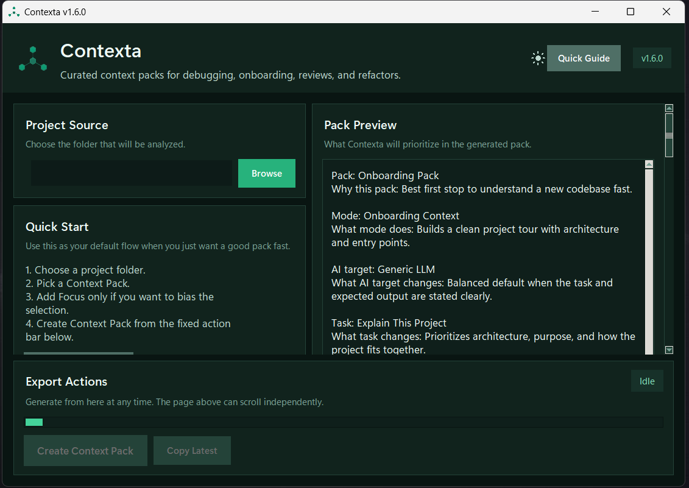

<div align="center">

# Contexta

**Packs de contexto curados para debug, onboarding, review, refactor e handoff entre IAs. O Contexta analisa o projeto primeiro e exporta o contexto mais útil para a tarefa.**

[](https://python.org)
[](LICENSE)
[]()
[]()
[]()

<br>

[](https://github.com/pablokaua03/Contexta/releases/latest/download/contexta.exe)
&nbsp;&nbsp;
[](https://github.com/pablokaua03/Contexta/releases/latest/download/contexta-linux.tar.gz)
&nbsp;&nbsp;
[](https://github.com/pablokaua03/Contexta/releases/latest)

> Portátil no Windows, instalável no Linux e executável a partir do código-fonte com Python.

<br>

<picture>
  <source media="(prefers-color-scheme: dark)" srcset="assets/dark.png">
  <source media="(prefers-color-scheme: light)" srcset="assets/white.png">
  
</picture>

</div>

---

## O que o Contexta exporta

Em vez de despejar arquivos cegamente, o Contexta monta um pack de contexto. Dependendo do pack, do modo e da tarefa, a saída pode incluir:

- resumo do projeto com stack, entry points, propósito provável e módulos centrais
- seção `Read This First` para orientar a leitura
- fluxo principal de execução
- arquivos centrais, arquivos de apoio, testes relacionados e contexto de arquivos alterados
- relationship map, riscos e pontos de impacto
- payload em Markdown pronto para colar no ChatGPT, Claude, Gemini, Copilot ou outra ferramenta

No modo `full`, o código continua presente. A inteligência entra em volta do payload, não no lugar dele.

---

## Principais recursos

| Recurso | Detalhe |
|---|---|
| GUI + CLI | Fluxo desktop para uso diário e CLI para automação |
| Packs de contexto | `custom`, `chatgpt`, `onboarding`, `pr_review`, `risk_review`, `debug`, `backend`, `frontend`, `changes_related` |
| Modos de contexto | `full`, `debug`, `feature`, `diff`, `onboarding`, `refactor` |
| Compressão | `full`, `balanced`, `focused`, `signatures` |
| Fingerprinting | Detecta stack, framework e tipo de projeto antes de selecionar arquivos |
| Análise syntax-aware | Usa tree-sitter com fallback heurístico para extrair símbolos em várias linguagens |
| Estimativa de tokens | Usa `tiktoken` para estimar melhor o tamanho dos packs |
| Relationship map | Destaca dependências locais e testes provavelmente relacionados |
| Build multiplataforma | Usa Nuitka no Windows e PyInstaller mais bundle instalável no Linux |

---

## Início rápido

### Windows

1. Baixe `contexta.exe` ou `contexta-setup.exe`
2. Execute
3. Escolha a pasta do projeto
4. Selecione pack, modo, tarefa e compressão
5. Gere o pack e cole o Markdown na IA

> O Windows ainda pode alertar sobre executáveis open-source sem assinatura.

### Linux

1. Baixe `contexta-linux.tar.gz`
2. Extraia o pacote
3. Rode `./install.sh` para instalar localmente ou execute o binário `contexta` direto

### Rodando pelo fonte

```bash
git clone https://github.com/pablokaua03/Contexta.git
cd Contexta
python -m pip install -r requirements.txt
python contexta.py
```

Em algumas distros Linux, o `tkinter` pode vir como pacote separado, como `python3-tk`.

---

## Build a partir do código

```bash
# Windows
.\build.bat

# Linux / macOS
chmod +x build.sh && ./build.sh
```

Importante:

- gere o build do Windows no Windows e o pacote Linux no Linux
- o build do Windows usa Nuitka e exige Visual Studio C++ Build Tools
- o build do Linux gera `dist/contexta` e também `dist/contexta-linux.tar.gz`
- em Debian/Ubuntu, instale `python3-tk` antes do build

Saídas do build:

- Windows: `dist/contexta.exe`
- Instalador do Windows: `dist/contexta-setup.exe` quando o Inno Setup estiver instalado
- Linux / macOS: `dist/contexta`
- Bundle instalável do Linux: `dist/contexta-linux.tar.gz`

---

## Testes

```bash
python -m unittest discover tests/
```

Use esse comando para ver a contagem mais recente da suíte.

---

## Segurança e comportamento

- o Contexta é read-only: não modifica o projeto analisado
- não envia telemetria nem exige rede para funcionar
- limites de scan evitam exports descontrolados
- payloads binários/base64 continuam suprimidos em excerpts focados
- as dependências de runtime são auxiliares locais de análise, não serviços externos

---

## Contribuindo

Veja [CONTRIBUTING.md](CONTRIBUTING.md)

## Changelog

Veja [CHANGELOG.md](CHANGELOG.md)

## Licença

[MIT](LICENSE) © [pablokaua03](https://github.com/pablokaua03)
