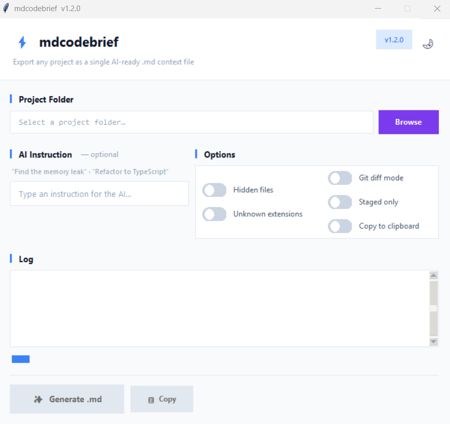

<div align="center">

# ⚡ mdcodebrief

**Escaneia qualquer projeto e gera um único arquivo `.md` com contexto completo de código, pronto para colar em interfaces de IA. Zero dependências de runtime, GUI + CLI.**

[](https://python.org)
[](LICENSE)
[]()
[]()
[]()

<br>

[](https://github.com/pablokaua03/mdcodebrief/releases/latest/download/mdcodebrief.exe)
&nbsp;&nbsp;
[](https://github.com/pablokaua03/mdcodebrief/releases/latest)

> Sem instalação. Só baixar e executar.

<br>



</div>

---

## O que é?

`mdcodebrief` é uma ferramenta desktop leve que varre recursivamente uma pasta de projeto e gera um único arquivo Markdown bem estruturado contendo:

- **Árvore visual de diretórios** do projeto inteiro
- Cada **arquivo-fonte** com blocos de código com syntax highlighting
- Caminhos relativos, tamanhos de arquivo e truncagem automática

A saída foi projetada para ser **colada diretamente em interfaces de chat de IA** (ChatGPT, Claude, Gemini, etc.) para que o modelo tenha contexto completo do seu projeto.

---

## Quando usar

| Situação | Como |
|---|---|
| **Pedir uma revisão de código para IA** | Rode no projeto completo e cole o `.md` |
| **Code review / análise de PR** | Use `--diff` para exportar apenas os arquivos alterados |
| **Onboarding de um novo dev** | Gere um snapshot completo da base de código |
| **Debugar com ajuda de IA** | Adicione `-p "Encontre o bug no fluxo de autenticação"` |
| **Refatorar com IA** | Adicione `-p "Refatore isso para TypeScript"` |

> **Quando NÃO usar:** projetos com milhares de arquivos ou assets gerados — use o modo `--diff` ou aponte para uma subpasta específica.

-----

## Recursos

| Recurso | Detalhe |
|---|---|
| 🖥️ **Interface visual** | Interface limpa com toggle de tema dark/light |
| ⌨️ **Modo CLI** | Execute sem interface para scripts ou CI |
| 🌳 **Árvore de diretórios** | Visualização ASCII no topo de cada arquivo gerado |
| 🎨 **Syntax highlighting** | 50+ extensões mapeadas |
| 🔒 **Filtragem inteligente** | Ignora `node_modules`, `__pycache__`, `.git`, build dirs, lock files, binários |
| 📋 **Suporte nativo ao `.gitignore`** | Lê e respeita as regras do `.gitignore` automaticamente |
| 📋 **Copiar para clipboard** | Um clique na GUI ou flag `--copy` na CLI |
| 🧮 **Estimativa de tokens** | Mostra `~Xk tokens` com recomendações de modelos |
| 🔀 **Modo Git diff** | `--diff` — varre apenas arquivos alterados |
| 🤖 **Injeção de instrução para IA** | Adiciona um prompt customizado no topo do output |
| 🌗 **Tema Dark / Light** | Toggle no header — troca instantaneamente |
| 🧪 **36 testes automatizados** | Cobertura de scanner, renderer, gitignore, tokens e segurança do modo diff |
| 📏 **Limites de segurança** | Arquivos truncados em 1 000 linhas; scan para em 2 000 arquivos |
| 🌍 **Multiplataforma** | Windows, macOS, Linux |
| 📦 **Zero dependências de runtime** | Apenas a biblioteca padrão do Python é necessária para executar pelo código-fonte |

---

## Início rápido

### Opção A — Baixar o executável (sem Python)

1. Baixe o `mdcodebrief.exe` pelo botão acima
2. Dê duplo clique para executar

> ⚠️ **Aviso do Windows SmartScreen:** Clique em **"Mais informações"** → **"Executar mesmo assim"**. Isso é normal para ferramentas open source sem certificado de assinatura pago. Você também pode executar direto pelo código com `python mdcodebrief.py`.

### Opção B — Executar pelo código fonte

```bash
git clone https://github.com/pablokaua03/mdcodebrief.git
cd mdcodebrief
python mdcodebrief.py
```

O `mdcodebrief` em si usa apenas a biblioteca padrão do Python. Em algumas distribuições Linux, o `tkinter` é distribuído como pacote de sistema separado, como `python3-tk`.

### Modo CLI

```bash
python mdcodebrief.py /caminho/para/projeto
python mdcodebrief.py /caminho/para/projeto -p "Encontre o memory leak"
python mdcodebrief.py /caminho/para/projeto --diff --copy
python mdcodebrief.py /caminho/para/projeto --diff --copy -p "Revise este PR"
```

---

## Opções CLI

| Flag | Descrição |
|---|---|
| `--hidden` | Incluir pastas/arquivos ocultos |
| `--unknown` | Incluir extensões não reconhecidas |
| `--diff` | Modo Git diff — apenas arquivos alterados |
| `--staged` | Apenas arquivos staged (`git diff --cached`) |
| `-p / --prompt` | Injeta instrução de IA no topo |
| `-c / --copy` | Copia output para clipboard |
| `-o / --output` | Caminho de saída personalizado |
| `--version` | Exibe a versão |

---

## Guia de estimativa de tokens

| Tokens | Modelos recomendados |
|---|---|
| < 8k | Maioria dos modelos |
| 8k – 32k | GPT-4o · Claude Sonnet · Gemini Flash |
| 32k – 128k | Claude 200k · Gemini 1.5 Pro |
| > 128k | Gemini 1.5 Pro 1M |

---

## Compilar executável

```bash
# Windows
.\build.bat

# Linux / macOS
chmod +x build.sh && ./build.sh
```

Para gerar o executável standalone, o projeto usa **PyInstaller** como dependência opcional de empacotamento. Ele não é necessário para executar o `mdcodebrief` pelo código-fonte.

---

## Rodar os testes

```bash
python -m unittest discover tests/
```

---

## Segurança

- **Somente leitura** — nunca modifica os arquivos do projeto
- Sem acesso à rede, sem telemetria e sem dependências externas de runtime
- Limites rígidos evitam scans infinitos

---

## Contribuindo

Veja [CONTRIBUTING.md](CONTRIBUTING.md)

---

## Changelog

Veja [CHANGELOG.md](CHANGELOG.md)

---

## Licença

[MIT](LICENSE) © [pablokaua03](https://github.com/pablokaua03)
